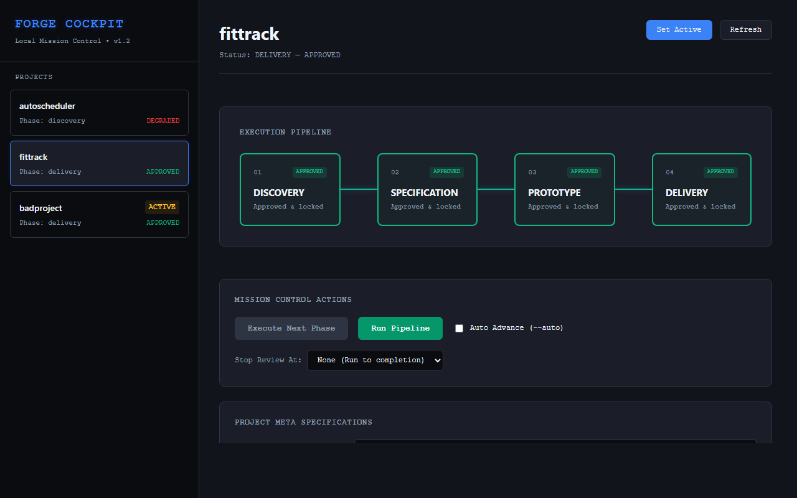
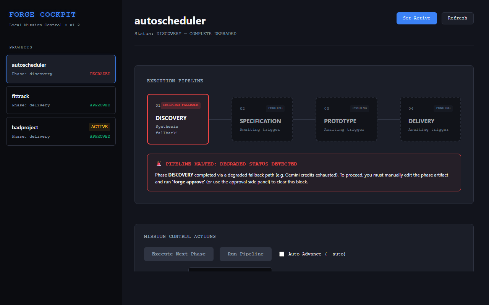
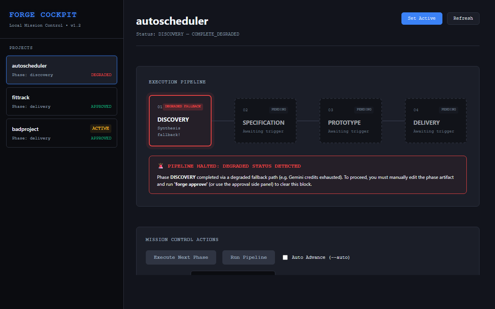

# Forge
### A human-in-the-loop pipeline that takes a product idea from Discovery to Delivery using AI agents.

> Forge orchestrates AI agents through the full product lifecycle — discovery, specification, prototype, delivery — with mandatory human review at every phase. The human stays in command; the agents execute.

This repository is a **showcase**: it documents the system, its architecture, and the engineering decisions behind it. The core engine is kept private as a working tool, but the design, the reasoning, and the cockpit are shown here in full.

---

## What Forge does

You give Forge a project brief — a product idea with business context. It runs a four-phase pipeline:

**Discovery** → research and competitor synthesis
**Specification** → a structured PRD, with strategic decisions escalated to the human
**Prototype** → a working scaffold
**Delivery** → tests, documentation, packaging

Each phase ends by writing an artifact and **stopping for human approval**. Nothing advances on its own. This checkpoint isn't a limitation — it's the entire point. Forge is not "AI does everything"; it's "AI executes, the human decides."

---

## The cockpit

Forge is operated through a visual mission-control dashboard — see the pipeline state, review each artifact rendered cleanly, approve with a click, and trigger runs.

*(Screenshots in `/images`.)*

---

## The story worth telling: the silence cascade

The most important thing Forge does is **fail loudly instead of failing silently** — and that capability exists because it once failed silently, and the failure taught the design.

**What happened.** Early on, Forge ran the four phases sequentially with human checkpoints between them. To move faster, the checkpoints were removed so the pipeline could run end to end on its own. Then a Discovery phase hit an exhausted AI API key and fell back to writing raw, unsynthesized output — *without anyone noticing*. Because the pipeline now ran unsupervised, Specification built on the empty Discovery, Prototype built on the empty Spec, and Delivery packaged the whole thing — reporting cheerful success over four phases of accumulated nothing. A **silence cascade**: a quiet failure compounding through every stage, hidden behind a "done."

**The diagnosis.** The root cause wasn't the API failure — APIs fail, that's expected. The root cause was that a degraded phase was allowed to *look* complete and advance. The convenience of removing the human checkpoint was exactly what let the silence propagate.

**The fix — making it mechanically impossible.** The lesson became a code invariant, not a guideline:

- A phase that completes via a fallback/degraded path is marked `complete_degraded`, never `complete`.
- The pipeline **refuses to advance** from a degraded state — even in automatic mode. Auto-run cannot bypass it.
- The only way past a degraded phase is an explicit human review and approval.
- Unexpected code errors propagate and surface; they are never disguised as API failures and routed into the silent-fallback path.

The result: the silence cascade is now impossible by construction. A degraded phase halts the pipeline and raises a visible alarm — in the CLI and in the cockpit — rather than quietly poisoning everything downstream.

**Why it matters.** This is the difference between "uses AI" and "understands the risks of operating AI in production." Automation that trusts blindly is dangerous; automation that knows when to stop and ask a human is trustworthy. That principle — surfaced by a real failure, hardened into an invariant — is the spine of the whole system.

---

## Architecture at a glance

- **Orchestration:** Python pipeline with per-phase agents and a single source of truth for state.
- **State:** local SQLite — one record per project, tracking phase and status.
- **Research:** web/competitor scraping feeding AI synthesis.
- **Safety:** the anti-fallback invariant described above, plus an audit trail for unsupervised runs.
- **Interface:** a FastAPI backend serving a React cockpit; markdown artifacts rendered for review; approvals and runs driven from the UI.
- **Design stance:** human-in-the-loop by default; supervised execution modes reduce friction without ever removing oversight.

---

## Design principles

1. **Fail loud, never silent.** A known invariant: degraded states halt and alarm.
2. **The human decides.** Strategic choices are escalated, never auto-resolved.
3. **No silent substitutions.** What the system does is what it says it does.
4. **Earn trust before scaling scope.** Prove one thing works before adding the next.

---

## Author

**Bruno Aragão**
AI Product Builder · Systems Orchestrator
[LinkedIn](https://www.linkedin.com/in/bruno-arag%C3%A3o-a610555a/) · [GitHub](https://github.com/aragaobruno)

---

*This repository documents Forge as a showcase. The production engine is maintained privately as a working tool.*
